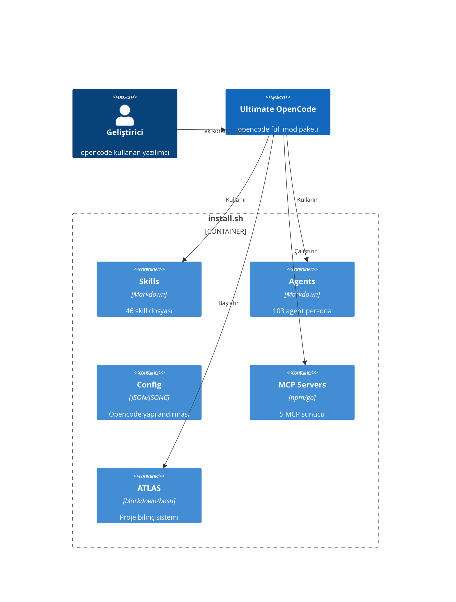
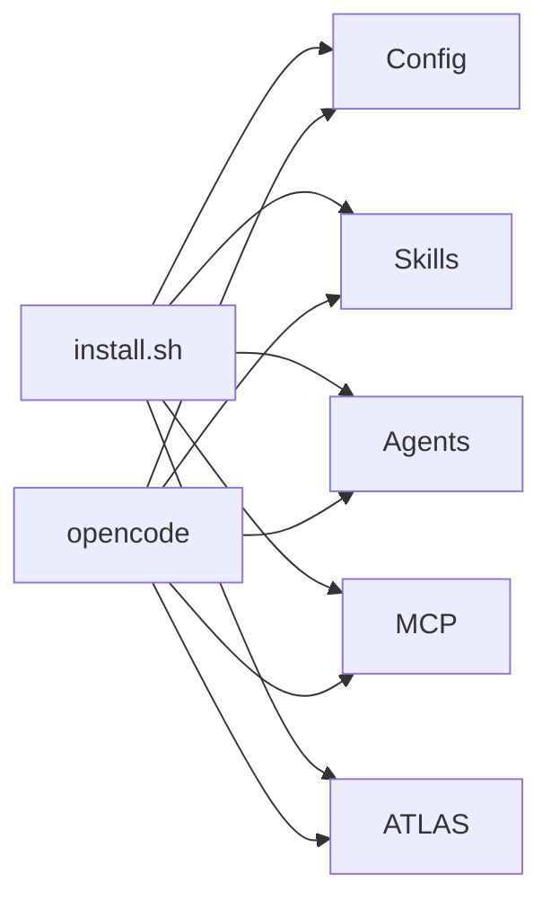

# Proje Mimarisi

## C4 Modeli (Container)



## Veri Akışı



## Dizin Yapısı

```
ultimate-opencode/
├── agents/        → 103 subagent persona (10 kategori)
├── atlas/         → 7 modüllü proje bilinç sistemi
├── commands/      → 14 slash komut
├── config/        → opencode yapılandırması
├── council/       → 18 AI persona
├── scripts/       → completion, systemd, plugin helper
├── skills/        → 46 skill dosyası
└── themes/        → 4 Catpuccin teması
```
