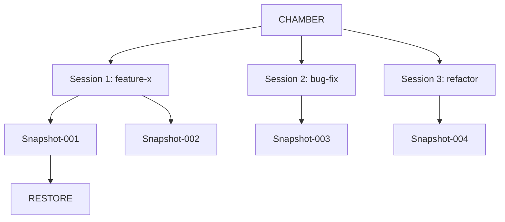

# ⚡ CHAMBER — Session Manager

CHAMBER, opencode oturumlarını yöneten, snapshot alan, geri yükleyen ve paralel ajanları orchestre eden **dünyada bir ilk** sistemdir.

## Problem

- opencode her seansı sıfırdan başlatır
- Context kaybı kaçınılmazdır
- Paralel ajanlar birbirinden habersiz çalışır
- Session state yönetimi yoktur

## Çözüm: CHAMBER

```bash
chamber new "feature-x"       # Yeni session oluştur
chamber list                  # Tüm session'ları listele
chamber switch feature-x      # Session'a geç
chamber snapshot               # Anlık state kaydet
chamber restore snapshot-001   # State geri yükle
chamber parallel "task1" "task2"  # Paralel çalıştır
chamber merge feature-x main   # Session'ları birleştir
```

## Komutlar

| Komut | Açıklama |
|---|---|
| `chamber new <ad>` | Yeni session başlat |
| `chamber list` | Session'ları listele |
| `chamber switch <ad>` | Session değiştir |
| `chamber snapshot` | State kaydet |
| `chamber restore <id>` | State geri yükle |
| `chamber parallel <g1> <g2>` | Paralel ajan çalıştır |
| `chamber merge <kaynak> <hedef>` | Session birleştir |

## Mimari



## Özellikler

- Tüm session state'i `~/.opencode/chamber/` altında saklanır
- Snapshot'lar JSON formatında
- Parallel exec için subagent orchestrator
- Session merge ile çakışma çözümü
