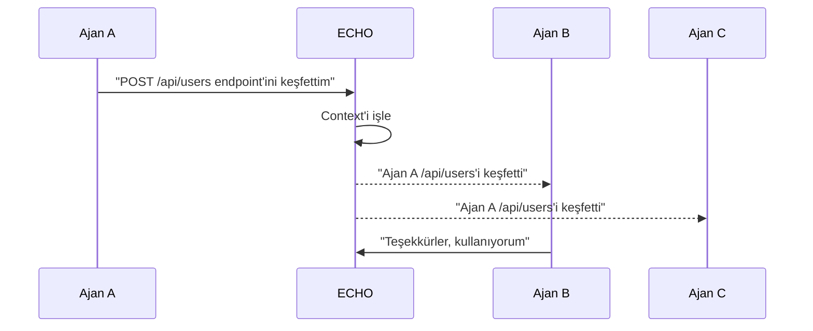

# 🔊 ECHO — Cross-Session Context Mirroring

ECHO, bir opencode session'ında öğrenilen bilgiyi, keşfedilen kodu, alınan kararları **anında diğer tüm session'lara yansıtan** yenilikçi bir sistemdir.

## Problem

- Ajan A bir API endpoint'i keşfeder → Ajan B aynı keşfi tekrar yapar
- Session 1'de bir bug çözülür → Session 2 aynı bug'la uğraşır
- Takım üyeleri aynı şeyleri defalarca keşfeder

## Çözüm: ECHO



## Kullanım

```bash
echo share "keşif: /api/users endpoint'i var"    # Bilgi paylaş
echo broadcast "uyarı: bu dosyada API key var!"   # Tüm session'lara duyur
echo status                                         # Paylaşılan context'i gör
echo history                                        # Geçmiş paylaşımlar
echo clear                                          # Context temizle
```

## Context Türleri

| Tür | Açıklama | Otomatik mi? |
|---|---|---|
| 🔍 Keşif | API, endpoint, dosya bulma | ✅ |
| 🐛 Bug | Hata ve çözümü | ✅ |
| 🏗️ Karar | Mimari kararlar | ✅ |
| ⚠️ Uyarı | Güvenlik, API key, risk | ✅ |
| 💡 İpucu | Kullanışlı bilgiler | ❌ (manuel) |

## Dosya Yapısı

```
~/.opencode/echo/
├── context.db        → Tüm paylaşılan context
├── discoveries.json  → Keşifler
├── bugs.json         → Hatalar
├── warnings.json     → Uyarılar
└── agents.json       → Ajan bağlantı durumu
```

## Entegrasyon

ECHO, ATLAS'ın team/sync modülü ile birlikte çalışır:
- ATLAS kalıcı bilgiyi depolar
- ECHO anlık paylaşımı sağlar
- Birlikte: **gerçek zamanlı takım bilinci**
