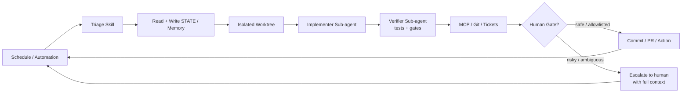

# Loop Engineering


<p align="center">
  <a href="https://cobusgreyling.github.io/loop-engineering/">
    
  </a>
</p>

<p align="center">
  <a href="https://github.com/cobusgreyling/loop-engineering/stargazers"></a>
  <a href="https://github.com/cobusgreyling/loop-engineering/actions/workflows/audit.yml"></a>
  <a href="https://www.npmjs.com/package/@cobusgreyling/loop-audit"></a>
  <a href="https://www.npmjs.com/package/@cobusgreyling/loop-init"></a>
  <a href="https://www.npmjs.com/package/@cobusgreyling/loop-cost"></a>
  <a href="https://github.com/cobusgreyling/loop-engineering/blob/main/LICENSE"></a>
  <a href="https://cobusgreyling.github.io/loop-engineering/"></a>
</p>


<p align="center">
  <a href="https://cobusgreyling.github.io/loop-engineering/">
    
  </a>
</p>

<p align="center">
  
</p>

**Loop engineering is replacing yourself as the person who prompts the agent. You design the system that does it instead.**

**New here?** [Quickstart (5 min)](docs/QUICKSTART.md) · [Interactive picker](https://cobusgreyling.github.io/loop-engineering/#interactive)

For developers using Grok, Claude Code, Codex, Cursor, and other AI coding agents.

A loop is a recursive goal: you define a purpose and the AI iterates (often with sub-agents, verification, and external state) until the goal is complete or the loop decides to hand off to you.


<p align="center">
  <strong><a href="https://cobusgreyling.github.io/loop-engineering/">→ Interactive showcase + pattern picker</a></strong>
  <br>
  <strong><a href="https://cobusgreyling.substack.com/p/loop-engineering">→ Loop Engineering essay (Substack)</a></strong>
  <br>
  <a href="https://addyosmani.com/blog/loop-engineering/">Canonical essay by Addy Osmani</a>
</p>

## Contents

- [Quickstart (5 min)](docs/QUICKSTART.md)
- [Quick Links](#quick-links)
- [Why This Matters](#why-this-matters)
- [The Five Building Blocks + Memory](#the-five-building-blocks--memory)
- [Patterns](#patterns)
- [Getting Started (5 minutes)](#getting-started-5-minutes)
- [Examples by Tool](#examples-by-tool)
- [Operating & Safety](#operating--safety)
- [Caveats](#caveats)
- [Contributing](#contributing)
- [Sources](#sources)
- [License](#license)

## Quick Links

| Start here | Description |
|------------|-------------|
| [Quickstart (5 min)](docs/QUICKSTART.md) | Scaffold → cost check → audit → first loop — **start here if you just landed** |
| [Loop Engineering essay](https://cobusgreyling.substack.com/p/loop-engineering) | The concept, primitives, and Grok mapping — read for the why |
| [Pattern Picker](docs/pattern-picker.md) | Which loop to run first — **start here if unsure** |
| [Primitives Matrix](docs/primitives-matrix.md) | Grok vs Claude Code vs Codex — bookmark this |
| [Loop Design Checklist](docs/loop-design-checklist.md) | Ship readiness rubric |
| [Patterns](patterns/README.md) | 7 production patterns + [interactive picker](https://cobusgreyling.github.io/loop-engineering/#interactive) |
| [Starters](starters/) | Clone-and-run kits (Grok, Claude Code, Codex) |
| [loop-audit](tools/loop-audit/) | Loop Readiness Score CLI (v1.4 + activity detection) — `npx @cobusgreyling/loop-audit . --suggest` · `--badge` for README |
| [loop-init](tools/loop-init/) | Scaffold starters + budget/run-log (v1.2) — `npx @cobusgreyling/loop-init . --pattern daily-triage --tool grok` |
| [loop-cost](tools/loop-cost/) | Token spend estimator — `npx @cobusgreyling/loop-cost` |
| [Goal Engineering](https://github.com/cobusgreyling/goal-engineering) | Companion: Grok Build `/goal` — run-until-done objectives (`npx @cobusgreyling/goal-audit`) |
| [Stories](stories/) | Real wins and honest failures |

<p align="center">
  
</p>

## Why This Matters

Peter Steinberger:
> “You shouldn’t be prompting coding agents anymore. You should be designing loops that prompt your agents.”

Boris Cherny (Head of Claude Code at Anthropic):
> “I don’t prompt Claude anymore. I have loops running that prompt Claude and figuring out what to do. My job is to write loops.”

The leverage point has moved from crafting individual prompts to designing the control systems that orchestrate agents over time.

## The Five Building Blocks + Memory

| Primitive | Job in the Loop |
|-----------|-----------------|
| **Automations / Scheduling** | Discovery + triage on a cadence |
| **Worktrees** | Safe parallel execution |
| **Skills** | Persistent project knowledge |
| **Plugins & Connectors** | Reach into your real tools (MCP) |
| **Sub-agents** | Maker / checker split |
| **+ Memory / State** | Durable spine outside any conversation |

Full detail: [docs/primitives.md](docs/primitives.md) · Cross-tool matrix: [docs/primitives-matrix.md](docs/primitives-matrix.md)

### Visual Overview

<p align="center">
  
</p>

### Anatomy of a Loop

<p align="center">
  
</p>

<details>
<summary>Mermaid diagram (copy-friendly)</summary>



</details>

**This reference repo now runs its own `validate-patterns` + `audit` workflows on every push/PR** (see `.github/workflows/`). We also added `LOOP.md` describing the loops that will maintain it.

## Patterns

<p align="center">
  
</p>

| Pattern | Cadence | Starter | Week 1 | Token cost |
|---------|---------|---------|--------|------------|
| [Daily Triage](patterns/daily-triage.md) | 1d–2h | [minimal-loop](starters/minimal-loop/) | **L1** report | Low |
| [PR Babysitter](patterns/pr-babysitter.md) | 5–15m | [pr-babysitter](starters/pr-babysitter/) | L1 watch | High |
| [CI Sweeper](patterns/ci-sweeper.md) | 5–15m | [ci-sweeper](starters/ci-sweeper/) | L2 cautious | Very high |
| [Dependency Sweeper](patterns/dependency-sweeper.md) | 6h–1d | [dependency-sweeper](starters/dependency-sweeper/) | L2 patch-only | Medium |
| [Changelog Drafter](patterns/changelog-drafter.md) | 1d or tag | [changelog-drafter](starters/changelog-drafter/) | **L1** draft | Low |
| [Post-Merge Cleanup](patterns/post-merge-cleanup.md) | 1d–6h | [post-merge-cleanup](starters/post-merge-cleanup/) | **L1** off-peak | Low |
| [Issue Triage](patterns/issue-triage.md) | 2h–1d | [issue-triage](starters/issue-triage/) | **L1** propose-only | Low |

Not sure which to pick? Try the [interactive picker](https://cobusgreyling.github.io/loop-engineering/#interactive) or [pattern-picker](docs/pattern-picker.md).

Machine-readable index: [patterns/registry.yaml](patterns/registry.yaml) (7 patterns)

## Getting Started (5 minutes)

```bash
# 1. Scaffold a starter (or copy manually — see starters/)
npx @cobusgreyling/loop-init . --pattern daily-triage --tool grok

# 2. Estimate token spend for your cadence
npx @cobusgreyling/loop-cost --pattern daily-triage --level L1

# 3. Audit readiness (budget + run-log now scored)
npx @cobusgreyling/loop-audit . --suggest

# Optional: paste Loop Ready badge into your README
npx @cobusgreyling/loop-audit . --badge

# 4. See scores climb: empty → L1 → L2
bash scripts/before-after-demo.sh

# 5. Start report-only (Grok example)
/loop 1d Run loop-triage. Update STATE.md. No auto-fix in week one.
```

All three CLIs publish to npm from tagged releases — see [docs/RELEASE.md](docs/RELEASE.md). No clone required.

**Develop from source** (monorepo contributors):

```bash
cd tools/loop-init && npm ci && npm test && node dist/cli.js /path/to/project --pattern daily-triage --tool grok
cd tools/loop-audit && npm ci && npm test && node dist/cli.js /path/to/project --suggest
cd tools/loop-cost && npm ci && npm test && node dist/cli.js --pattern ci-sweeper --cadence 15m
```

Phased rollout: **L1 report → L2 assisted fixes → L3 unattended** — see [loop-design-checklist](docs/loop-design-checklist.md).

## Examples by Tool

- [Grok](examples/grok/daily-triage.md)
- [Claude Code](examples/claude-code/)
- [Codex](examples/codex/)
- [GitHub Actions](examples/github-actions/)

## Operating & Safety

- [Failure Modes](docs/failure-modes.md) — incident-style catalog
- [Anti-Patterns](docs/anti-patterns.md) — design mistakes before production
- [Multi-Loop Coordination](docs/multi-loop.md) — when loops collide
- [Operating Loops](docs/operating-loops.md) — cost, logging, when to kill
- [Safety](docs/safety.md) — denylist, auto-merge, MCP scopes
- [Security](SECURITY.md) — reporting and unattended automation risks
- [Concepts](docs/concepts.md) — intent debt, comprehension debt, harness vs loop
- [MCP Cookbook](examples/mcp/) — connector examples by pattern

## Caveats

Loop engineering amplifies judgment — both good and bad.

- **Token costs** can explode with sub-agents and long-running loops.
- **Verification is still on you.** Unattended loops make unattended mistakes.
- **Comprehension debt** grows faster unless you read what the loop ships.
- Two people can run the same loop and get opposite results. The loop doesn't know. You do.

Addy Osmani:
> “Build the loop. But build it like someone who intends to stay the engineer, not just the person who presses go.”

## Contributing

Share production patterns, tool mappings, and failure stories. See [CONTRIBUTING.md](CONTRIBUTING.md), [adopters](docs/adopters.md), and [GitHub Discussions](https://github.com/cobusgreyling/loop-engineering/discussions).

## Sources

- [Cobus Greyling – Loop Engineering (Substack)](https://cobusgreyling.substack.com/p/loop-engineering)
- [Addy Osmani – Loop Engineering](https://addyosmani.com/blog/loop-engineering/)
- [Attribution & further reading](resources/sources.md)

## License

MIT

---

*Practical, tool-aware reference for loop engineering — patterns you can clone, checklists you can ship against, and stories that include what broke.*

<p align="center">
  <a href="https://cobusgreyling.substack.com/p/loop-engineering">Essay</a>
  ·
  <a href="https://cobusgreyling.github.io/loop-engineering/">Showcase</a>
  ·
  <a href="https://github.com/cobusgreyling">Cobus Greyling</a>
</p>
